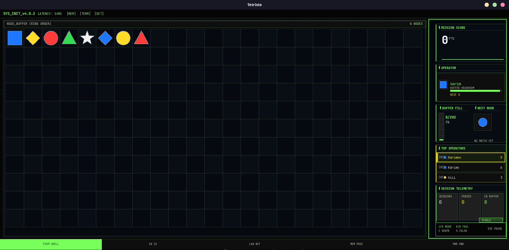
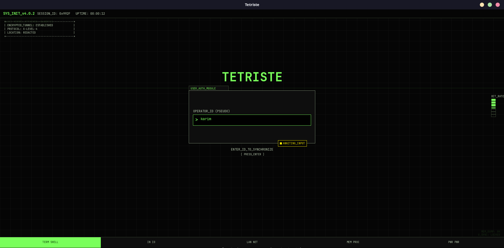
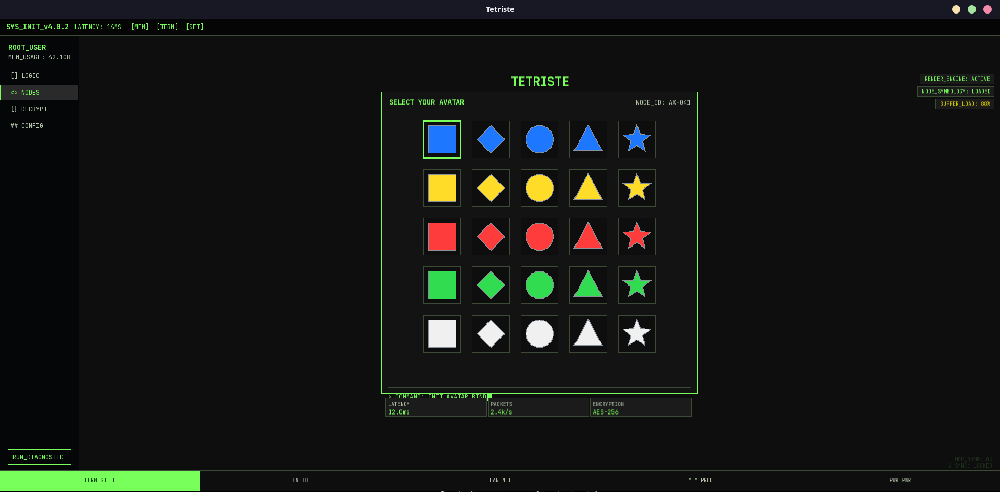
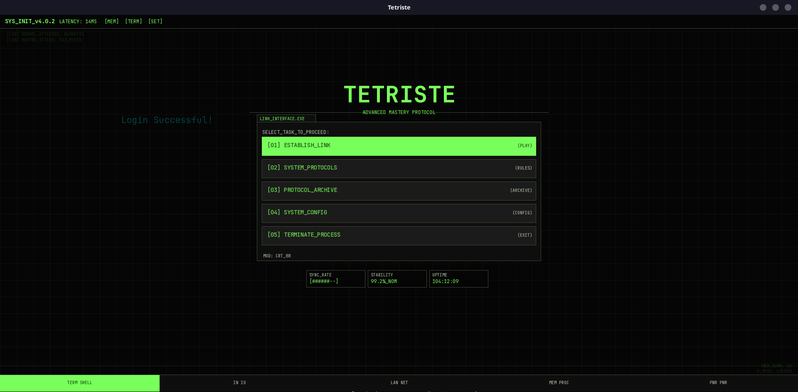
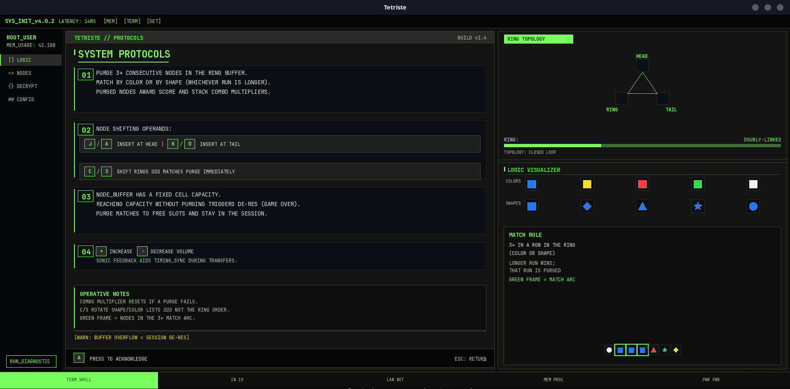
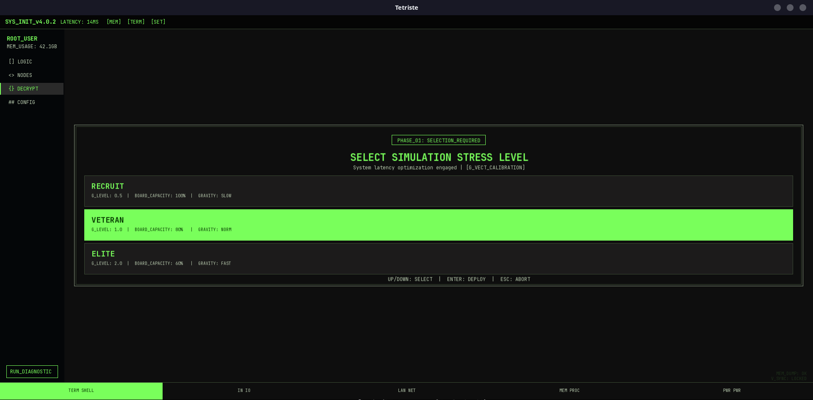
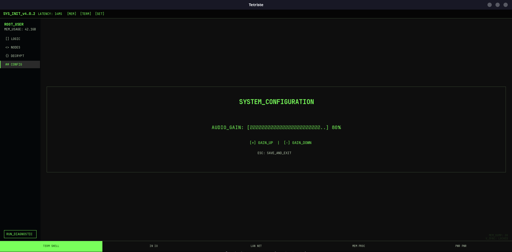
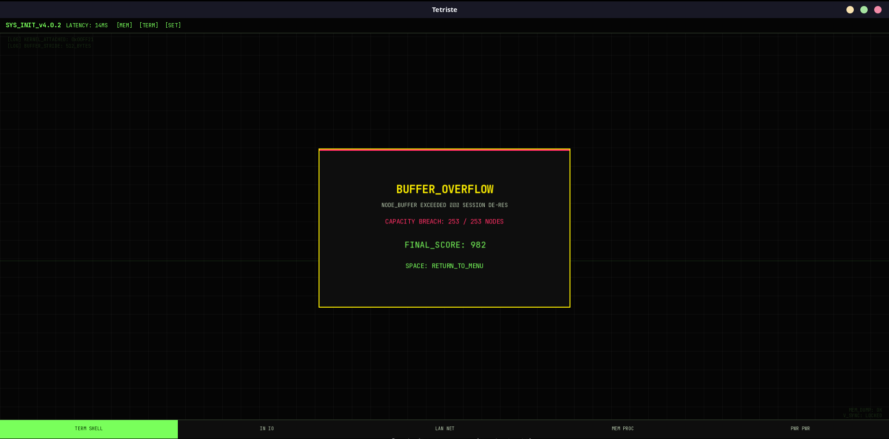

# Tetriste

**A ring-buffer logic puzzle with a cyberpunk tactical terminal UI.**


Built in **C++11** and **SFML**. Manage a circular node buffer, purge matching sequences, and survive buffer overflow — wrapped in a full operator-style interface (login, HUD, protocols, leaderboard).

<p align="center">
  
</p>

<p align="center">
  <sub><b>Gameplay</b> — insert nodes at head/tail, purge 3+ matches, monitor buffer capacity in real time.</sub>
</p>

---

## Table of contents

- [Learning objective](#learning-objective)
- [What is Tetriste?](#what-is-tetriste)
- [Screenshots](#screenshots)
- [Features](#features)
- [How to play](#how-to-play)
- [Quick start](#quick-start)
- [Project structure](#project-structure)
- [Tech stack](#tech-stack)
- [License](#license)
- [Credits](#credits)

---

## Learning objective

Tetriste was built to **strengthen algorithmic practice in C++** — a playable sandbox where classic structures and traversals meet real constraints (insertion, rotation, cascade deletes, preview without mutation).

| Algorithm / structure | Used for | Why |
|----------------------|----------|-----|
| **Circular singly-linked list** | Main node ring (`head`, `nextPiece`) | O(1) head/tail insert; nodes stay in ring order |
| **Circular doubly-linked sub-rings** | Color & shape rings (`colorPrev/Next`, `shapePrev/Next`) | Rotate one color/shape group without scanning the whole buffer |
| **Ring traversal** (`do…while`) | Tail lookup, shifts, match scans | Bounded walk on a cyclic structure |
| **Bidirectional expansion** (`consecutiveRun`) | Match length on the ring | Count consecutive nodes forward + backward from an anchor |
| **Virtual ring simulation** | Match preview before insert | Test head/tail outcomes without mutating live state |
| **Hash set** (`unordered_set`) | `collectMatchPreview` | Deduplicate nodes in the winning arc |
| **Iterative cascade purge** | `updateGame` loop | Repeat detection → delete until the board stabilizes |
| **Multi-list splice / unlink** | Node removal | Keep main, color, and shape rings consistent after a purge |
| **Greedy comparison** | Color vs shape run | Take the longer winning sequence when both match |
| **Sorting** (`std::sort`) | Leaderboard | Rank operators by best score |

---

## What is Tetriste?

Tetriste is a **logic puzzle** disguised as a military terminal. You operate a **ring-shaped node buffer**: colored geometric pieces flow in order, and you decide whether each new node lands at the **head** or **tail**.

Your job:

1. **Insert** the incoming node (head or tail).
2. **Purge** runs of **3+ consecutive** nodes that share the same **color** or **shape**.
3. **Shift** color/shape sub-rings when a rotation sets up an immediate match.
4. **Survive** — if the buffer hits capacity without a purge, the session ends in **BUFFER OVERFLOW**.

Under the hood, every piece lives in **three circular lists** at once (main ring, color ring, shape ring) — a compact showcase of linked-list design in C++.

---

## Screenshots

### Operator login
Authenticate as an operator before entering the system.

<p align="center">
  
</p>

### Avatar selection
New operators bind a piece avatar before their first session.

<p align="center">
  
</p>

### Main menu
Navigate missions, protocols, archive, and configuration from the terminal shell. Live stats show **sessions**, **best**, and **last** score.

<p align="center">
  
</p>

### System protocols
Full rules reference with key chips, ring topology diagram, and logic visualizer.

<p align="center">
  
</p>

### Difficulty selection
Choose stress level — Recruit, Veteran, or Elite — each changes board capacity and pressure.

<p align="center">
  
</p>

### Settings
Adjust audio gain and persist preferences to `config.json`.

<p align="center">
  
</p>

### Game over
Buffer overflow ends the session; final score is saved to your operator profile.

<p align="center">
  
</p>

---

## Features

| Category | Details |
|----------|---------|
| **Core loop** | Head/tail insert · 3+ match purge · combo multipliers |
| **Ring shifts** | Shape ring (`C`) and color ring (`S`) — matches purge immediately |
| **Tactical HUD** | Mission score · operator panel · buffer fill · next-node preview · top operators |
| **Match preview** | Green frame highlights the winning purge arc before you commit |
| **Difficulty** | Recruit (100% capacity) · Veteran (80%) · Elite (60%) |
| **Full UI flow** | Login → avatar → menu → protocols → difficulty → play → pause → game over |
| **Persistence** | Sessions increment on play start · scores/records saved on session end · purge counts live · `users.json` + `config.json` |
| **Theme** | Surgical Cyberpunk — JetBrains Mono, neon green tactical chrome |

---

## How to play

### Controls

| Key | Action |
|-----|--------|
| `J` / `A` | Insert next node at **head** |
| `K` / `D` | Insert next node at **tail** |
| `C` | Shift **shape** ring |
| `S` | Shift **color** ring |
| `P` | Open protocols overlay (in-game) |
| `Esc` | Pause |
| `+` / `-` | Volume up / down (settings) |

### Match rules

1. **3+ consecutive nodes** in the ring match by **color** *or* **shape**.
2. If both apply, the **longer run** wins and is purged.
3. Purged nodes add **score**; chains build a **combo multiplier**.
4. **C / S** can trigger a purge **without** inserting a new node.
5. **Green outline** = nodes in the current match preview arc.
6. **Buffer full + no purge** → `BUFFER OVERFLOW` (game over).

### Difficulty tiers

| Tier | Board capacity | Intended for |
|------|----------------|--------------|
| **Recruit** | 100% | Learning the ring and match timing |
| **Veteran** | 80% | Standard sessions |
| **Elite** | 60% | Tight buffer, high pressure |

---

## Quick start

### Prerequisites

- C++11 compiler (GCC 7+, Clang 5+, or MSVC 2017+)
- [SFML](https://www.sfml-dev.org/download.php) 2.5+ (`graphics`, `window`, `audio`, `system`)
- CMake 3.10+

**Ubuntu / Debian:**
```bash
sudo apt install build-essential cmake libsfml-dev
```

### Build & run

```bash
git clone https://github.com/Abdelkrim7Be/Tetriste_Game.git
cd Tetriste_Game
mkdir -p build && cd build
cmake ..
make -j$(nproc)
./Tetriste
```

Run from `build/` — the game resolves `build/assets/` automatically for textures, profiles, and config.

### Run tests (optional)

```bash
cd build
make test_logic test_userManager
./test_logic && ./test_userManager
```

---

## Project structure

```
Tetriste/
├── assets/              # Runtime: textures, fonts, users.json, config.json
├── docs/screenshots/    # README images (not loaded by the game)
├── include/nlohmann/    # Vendored JSON
├── src/
│   ├── main.cpp         # Entry point & game loop
│   ├── core/            # Game logic, Piece, color/shape enums
│   ├── platform/        # AssetManager, UserManager
│   └── ui/              # Renderer, UITheme
└── tests/               # Logic & persistence unit tests
```

| Layer | Responsibility |
|-------|----------------|
| `src/core` | Ring buffer, insert/purge/shift, match detection |
| `src/platform` | Textures, audio, JSON persistence |
| `src/ui` | All screens, HUD, protocols overlay |

---

## Tech stack

| Technology | Role |
|------------|------|
| **C++11** | Core language |
| **SFML 2.x** | Rendering, input, audio |
| **CMake** | Cross-platform build |
| **nlohmann/json** | User profiles & config |
| **JetBrains Mono** | UI typography (SIL OFL) |

---

## License

This project is licensed under the [MIT License](LICENSE).

---

## Credits

- [SFML](https://www.sfml-dev.org/) — multimedia layer
- [nlohmann/json](https://github.com/nlohmann/json) — JSON for C++
- [JetBrains Mono](https://www.jetbrains.com/lp/mono/) — terminal font

---

<p align="center">
  <sub>Tetriste v1.4 · C++ / SFML · Ring-buffer tactical puzzle</sub>
</p>
